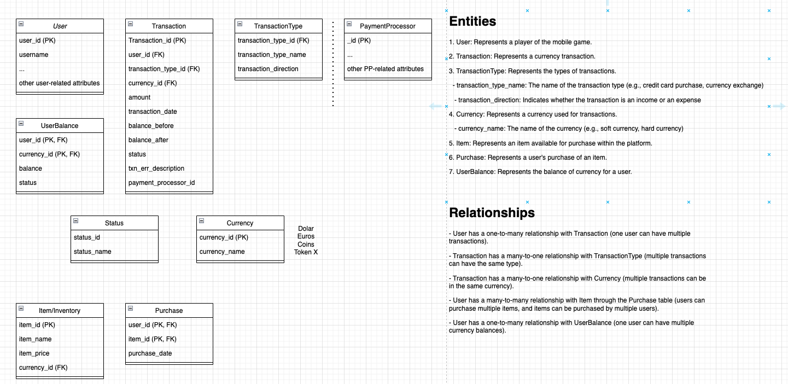

<p align="center">
  <a href="http://nestjs.com/" target="blank"></a>
</p>

[circleci-image]: https://img.shields.io/circleci/build/github/nestjs/nest/master?token=abc123def456
[circleci-url]: https://circleci.com/gh/nestjs/nest

  <p align="center">A progressive <a href="http://nodejs.org" target="_blank">Node.js</a> framework for building efficient and scalable server-side applications.</p>
    <p align="center">


## Accounting System for Mobile Game: Overview

### Purpose:
The accounting system is designed to manage and record the economic interactions within the mobile game, facilitating a transparent, organized, and efficient tracking mechanism for both in-game and real-world transactions.

### Key Features:

1. **User Management**: Records player data, ensuring each player's transactions and purchases are individually tracked.
2. **Transaction Handling**: Logs every currency transaction, be it real-world money or in-game currency. This includes purchase history, currency type, and transaction date.
3. **Diverse Transaction Types**: Supports various types of transactions, such as credit card purchases and in-game currency exchanges.
4. **Currency Management**: Facilitates multiple in-game currencies, allowing for a richer gaming experience.
5. **In-Game Item Catalog**: Manages the virtual items available for players to purchase, including their pricing in the respective in-game currency.
6. **Purchase History**: Maintains a record of items purchased by players, ensuring a historical log of all in-game purchases.
7. **User Balance Tracking**: Keeps track of players' balances for each in-game currency, ensuring players always have a clear view of their resources.
8. **Status Indicators**: Provides clear status feedback on transactions, such as success, failure, or pending.
9. **Payment Processor Integration**: Incorporates various payment gateways or methods, streamlining the real-world money transaction process.

### Conclusion:
This mobile game accounting system is a comprehensive solution designed to foster a seamless and transparent economic environment within the game. By accurately tracking transactions, user balances, and in-game purchases, it ensures both players and developers have a clear, organized view of all economic activities.

## Accounting model



---

## Installation
[Nest](https://github.com/nestjs/nest) framework TypeScript starter repository.

```bash
$ npm install
```

## Running the app

```bash
# development
$ npm run start

# watch mode
$ npm run start:dev

# production mode
$ npm run start:prod
```

## Test

```bash
# unit tests
$ npm run test

# e2e tests
$ npm run test:e2e

# test coverage
$ npm run test:cov
```

## License

Nest is [MIT licensed](LICENSE).
